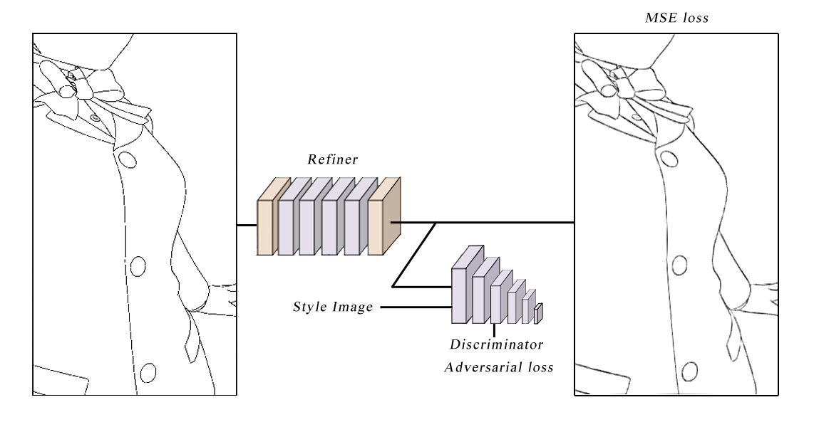
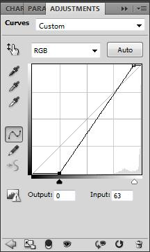
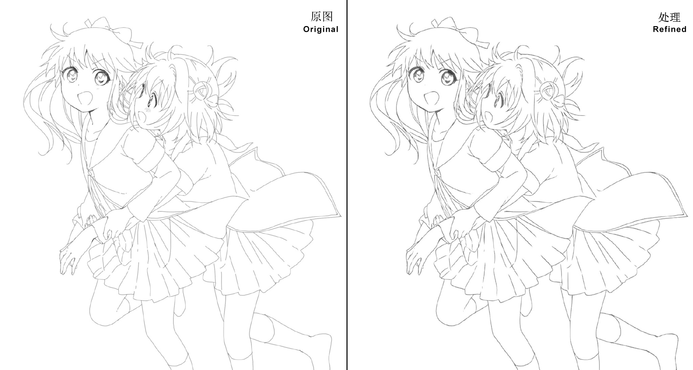
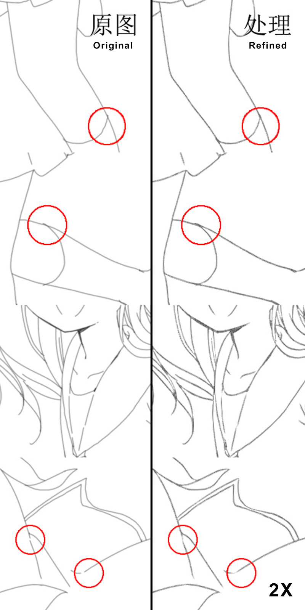
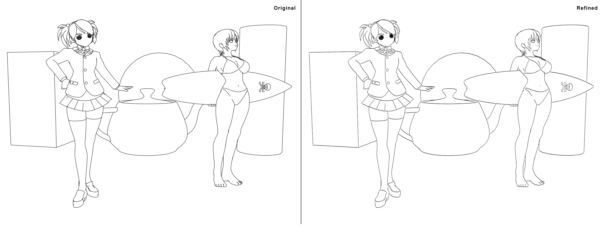
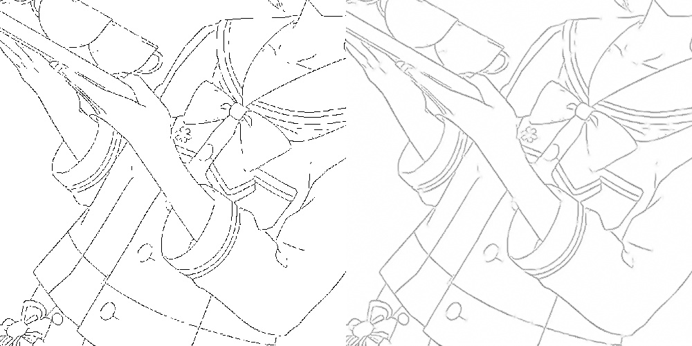

# LineRelifer

 

A data-driven line refiner for line-drawing (NPR and hand-drawn) stylization using Keras.

## Overview
In non-photorealistic rendering, the stylization of line-drawing is an important task. Present commercial software provides such style control through parametric or interactive manipulations. For example, in FinalToon and Pencil+, users are allowed to control the width and opacity of the strokes with maps or values. Futhermore, other effects like noise can be applied to strokes. These systems often rely on the 3D object`s properties, such as UV coordination, normal, curvature. But in real application, painters have more consideration on the expression of drawing, and these styles would be very difficult to describe parametrically with geometric characteristics. To solve these problems, learning based systems have been proposed [Learning Style Translation for the Lines of a Drawing](web.mit.edu/cocosci/Papers/line-drawings-in-press.pdf) [1]. However these approaches use vector graphics as input, and cannot be used for raster images directly. Using vector graphics limits the amount of training data and the diversity of styles. Recent advance in deep learning provides a new method for processing raster image directly and has achieved good results [Mastering Sketching: Adversarial Augmentation for Structured Prediction](http://hi.cs.waseda.ac.jp/~esimo/en/research/sketch_master/) [2].

This work propose a deep-learning based approach to line-drawing (NPR and hand-drawn) stylization problem. We received inspiration from [2] and [Learning from Simulated and Unsupervised Images through Adversarial Training](https://arxiv.org/pdf/1612.07828v1.pdf) [3]. Our approach build upon the framework like [2] and [3], which uses an adversarial network similar to Generative Adversarial Networks (GANs). To achieve production oriented target, it has smaller network than [2] and can run on CPU with acceptable speed. This network is able to generate highly realistic styled line-drawings with HD size when memory is enough. It can also fill gaps between strokes, denoise and correct shapes in line-drawings.

## Dependencies
* Keras2 (Tensorflow backend)
* OpenCV3

## Usage
1. Set up directories.

The data should be organized into directories. The directory tree is:

* `data/predict`, contains the images for prediction
* `data/result`, contains the output results from prediction

2. Download the model from release and put it in the same folder with code, then rename to `model.h5`.

3. Run `predict.py` for prediction.

## Models
**model_180317.h5**: Model trained using MSE and adversarial loss with private dataset for 10000 epochs.

## Post-processing
To achieve production level, the result should be post-processed. You can use any image editing software. Here shows the method in Photoshop with OLM smoother.
* Convert color mode to RGB
* Use curve to achieve desire style
 
 
 * Use OLM smoother to do AA.

## Notes
* Input should have white background and black lines.
* Prefered stroke width is 1 to 3 px (AA or NoAA).
* Memory cost for HD image is heavy, make sure computer has enough memory (>8 GB).
* It can work as post-processing tool for LineDistiller.

## Further Work
* Better network structure and more styles.
* A deep-learning based thinning and vectorization tool for line-drawings.
* Use CAN structure for refiner.
* Filling gap function is separated into individual project LineCloser, code and model will be upload soon.

## Examples
* Click to enlarge and view details. 
* Result on hand-drawn line-drawing without width change on strokes. Pictures from web.
 
 
 
* Result on 3d NPR line-drawing.
 
 
 
 
* Result on filling gap.
  

[Weibo](http://photo.weibo.com/1252089801/talbum/detail/photo_id/4217107768569026) **[Chinese]**

From **Project HAT** by Hepesu With :heart:
